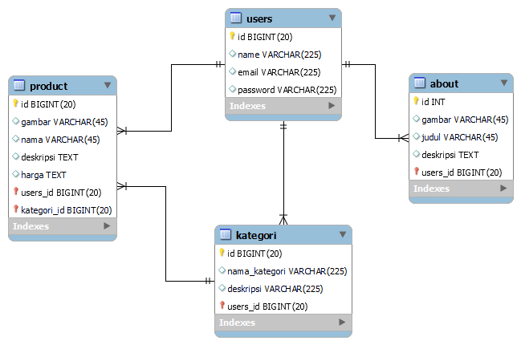

## Feane

Website Feane adalah website ecommerce burger , dengan produk yang lezat

## Erd

## Cara Install

git clone https://github.com/Necrophoo/project-final.git
composer update
cp .env.example .env
php artisan db:seed --class=LoginSeeder
php artisan db:seed --class=KategoriSeeder
php artisan migrate
php artisan serve

/ ( untuk halaman user)

/login (login ke halaman admin)
email admin@gmail.com
password admin1234

untuk contoh gambar ada di public/storage
